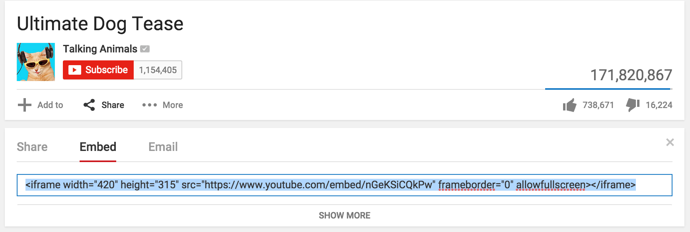

#HTML

## Was ist HTML?
HTML ist Sprache um Webseiten zu bauen. Mit HTML kann man _beschreiben_, wie eine Webseite aussehen soll. Im engeren Sinne ist es deswegen eigentlich keine Programmiersprache, sondern lediglich eine beschreibene Sprache.

HTML Dateien enden mit dem Dateiformat `.html` und können ganz einfach vom Browser geöffnet werden.

**Erstelle eine leere Textdatei namens `index.html` und öffne sie im Browser.**

## Grundgerüst HTML
Das Grundgerüst von HTML sieht immer so aus:

```
<html>

    <head>
    </head>
    
    <body>
    </body>
    
</html>
```

Die spitzen Klammern beschreiben immer einen Bereich. `<html>` beginnt einen html Bereich oder Abschnitt. `</html>` beendet ihn.

Die Einrückungen sind eigentlich unwichtig.

Diese Schreibweise ist genauso korrekt:

```
<html><head></head><body></body></html>
```
Diese sagt auch das gleiche:

```
<html>
<head>
</head>
<body>
</body>
</html>
```
Allerdings ist es ein guter Stil, den Code richtig einzurücken. Also gewöhnt es euch am besten sofort an :) Außerdem ist es besser lesbar.

## Der Head-Bereich
Im Head - also dem Kopfteil - sind Informationen, die nicht auf der Webseite selbst dargestellt werden. Stattdessen sind hier andere Informationen drin, die nur indirekt mit der eigentlichen Webseite zu tun haben. Man nennt solche Informationen auch Meta-Informationen.

Ein Beispiel wäre zum Beispiel der Titel einer Webseite.

```
<html>

    <head>
        <title>Meine Webseite</title>
    </head>
    
    <body>
    </body>
    
</html>

```

**Probier es aus und finde raus, wo der Titel auftaucht.**

## Der Body-Bereich
Im Body ist der eigentliche Inhalt der Webseite. Wenn ich zum Beispiel einen Text auf meiner Webseite haben möchte, Schreibe ich ganz einfach den Text in den Body.

```
<html>

    <head>
        <title>Meine Webseite</title>
    </head>
    
    <body>
        Willkommen auf meiner Webseite!
        
        Hier werde ich alles ausprobieren, 
        was ich auf dem ScienceCamp Informatik 
        gelernt habe und eine coole Webseite bauen.
        
        Diese Seite wird in einer Woche 
        wirklich toll aussehen!
    </body>
    
</html>
```

**Schreibe deine erste HTML-Seite mit Inhalt.**

Wie du siehst, ist die Formatierung des Textes auf der Webseite leider nicht so, wie wir es uns wünschen. Dafür müssen wir noch einige Textformatierungen lernen:

* `<br/>` ist eine Abkürzung für break, also ein Zeilenumbruch
* `<h1>Überschriften</h1>` kann man mit h1-Tags schreiben. `h` ist die Abkürzung für Headline, also einer Überschrift. statt `h1` kann man auch `h2` oder `h3` usw. benutzen. Die Überschriften werden mit steigender Zahl kleiner.
* `<p>Paragraphen</p>` kann man mit p-Tags beschreiben. Die sind nicht unbedingt nötig, sind aber zu empfehlen.

**Versuche nochmal deine erste Seite zu schreiben indem du die neu gelernten Tags anwendest.**

```
<html>

    <head>
        <title>Meine Webseite</title>
    </head>
    
    <body>
        <h1>
            Willkommen auf meiner Webseite!
        </h1>
        <p>
            Hier werde ich alles ausprobieren, 
            was ich auf dem ScienceCamp Informatik 
            gelernt habe und eine coole Webseite bauen.
        </p>
        <p>
            Diese Seite wird in einer Woche 
            wirklich toll aussehen!
        </p>
    </body>
    
</html>
```

Es gibt auch weitere Tags für Text wie zum Beispiel `<strong> text </strong>` oder `<em> text </em>`.

**Probier strong und em aus.**

## Mehr als nur Text
Webseiten bestehen üblicherweise aus mehr als nur Text. Moderne Webseiten haben Bilder, Links oder Listen.

### Bilder
Bilder kann man wie folgt einfügen:

```

```

Der Pfad zum Link ist eine Angabe, wo sich das Bild befindet.

Beispiel:
Wenn diese HTML Datei und das Bild im gleichen Ordner sind, also so:

```
irgendein Ordner
├── index.html
└── bild.jpg
```
dann wäre das Bild so aufzurufen: ``

Wenn diese HTML Datei in einem Ordner ist, in dem sich ein weiterer Ordner `bilder` befindet, in dem bilder drin sind, also so:

```
irgendein Ordner
├── index.html
└── Ordner
    └── bild.jpg
```
dann wäre das Bild so aufzurufen: ``

Du kannst alle möglichen Bildformate benutzen. Es funktioniert zum Beispiel auch mit `.gif` oder `.png`-Dateien.


Du kannst auch auf Bilder von anderen Webseiten zugreifen.

Auf `https://33.media.tumblr.com/84cc72a0291e73ceec2cc06db557b918/tumblr_nl86t1fj2w1qhy6c9o1_r2_1280.gif` ist zum Beispiel ein Bild. Um dieses anzuzeigen, kannst du lediglich den Link einfügen, also:

``


Falls du deine Webseite mal online stellst, solltest du das allesdings aus verschiedenen Gründen (z.B. Copyright) vermeiden. Für den kleinen persönlichen Gebrauch ist es aber erstmal ok.

### Links
Webseiten brauchen natürlich auch Links zu anderen Webseiten:

```
<a href="PFAD_ZUM_LINK"> Text </a>
```
Auch hier gilt wie bei Bildern: Du kannst du externen Links verlinken oder auch eine eigene HTML-Seite mit dem Pfad angeben:

`<a href="https://de.wikipedia.org/wiki/Hyperlink"> Wikieintrag zu Hyperlinks </a>`

<a href="https://de.wikipedia.org/wiki/Hyperlink"> Wikieintrag zu Hyperlinks </a>

Der Inhalt innerhalb des a-Tags ist der Teil, der dann anklickbar ist und zum Link führt.
Du kannst auch Bilder als Link benutzen:

```
<a href="https://de.wikipedia.org/wiki/Haushund"> 
    
</a>
```

<a href="https://de.wikipedia.org/wiki/Haushund"> 
    
</a>

Wie du merkst, öffnet sich der Link direkt im aktuellen Tab oder Fenster. Manchmal (vor allem bei Links zu externen Seiten), möchte man den Link lieber in einem neuen Tag öffnen. 
Setze dafür ein `target`, also ein Ziel:

```
<a href="https://de.wikipedia.org/wiki/Hyperlink" target="_blank"> 
    Wikieintrag zu Hyperlinks 
</a>
```
<a href="https://de.wikipedia.org/wiki/Hyperlink" target="_blank"> 
    Wikieintrag zu Hyperlinks 
</a>


### Listen
Listen macht man mit einem ul-Tag und jeder einzelne Bulletpoint wird mit einem li-Tag beschrieben. So sieht das dann aus:

```
Einkaufsliste
<ul>
    <li> Eiscreme </li>
    <li> Smoothie </li>
    <li> Kekse </li>        
</ul>
```

Einkaufsliste
<ul>
    <li> Eiscreme </li>
    <li> Smoothie </li>
    <li> Kekse </li>        
</ul>


## Glückwunsch! 
**Du kannst nun alle Basics für HTML <3**

Aber ehrlich gesagt sieht unsere Webseite noch nicht wirklich schön aus. Wir könnten zwar auch mit HTML unser Design machen, aber es gibt ein viel besseres Tool, um das zu bewerkstelligen. Es nennt sich **CSS**.

# CSS

# Sonstiges
## Embeddings
Viele Seiten bieten dir oftmals sogenannte _Embed_-Möglichkeiten an um gewissen Sachen auf deiner eigenen Webseite anzuzeigen.
Auf YouTube kann man zum Beispiel jedes Video einfügen:



<iframe width="420" height="315" src="https://www.youtube.com/embed/nGeKSiCQkPw" frameborder="0" allowfullscreen></iframe>

**Füge dein Lieblings-YouTube Video ein.**

## <!DOCTYPE html>
HTML ist eine Markup Language. Neben HTML gibt es weitere, andere Markup Languages. Du erkennst diese, dass sie immer Bereiche mit Tags und spitzen Klammern verwenden. Eigentlich muss man daher immer am Anfang der Datei sagen, um was für eine Markup Language es sich handelt. Richtig wäre daher:

```
<!DOCTYPE html>
<html>

    <head>
    </head>
    
    <body>
    </body>
    
</html>

```

Wie du aber bereits gesehen hast, funktioniert es auch ohne. Aber für einen sauberen Programmierstil, willst du es vielleicht drin haben.

## Browser Inspection
(Fast) alle Webbrowser bieten dir Möglichkeiten an, den HTML-Code von Webseiten zu sehen. Dies ist zum Beispiel praktisch, wenn du etwas von anderen Webseiten toll findest und es nachbauen möchtest. Es hilft aber auch, um an der eigenen Webseite zu basteln und schneller Änderungen zu sehen.

**[Twitter](https://twitter.com/) hat zum Beispiel abgerundete Ecken um Textboxen. Finde heraus wie man das mit CSS umsetzt.**